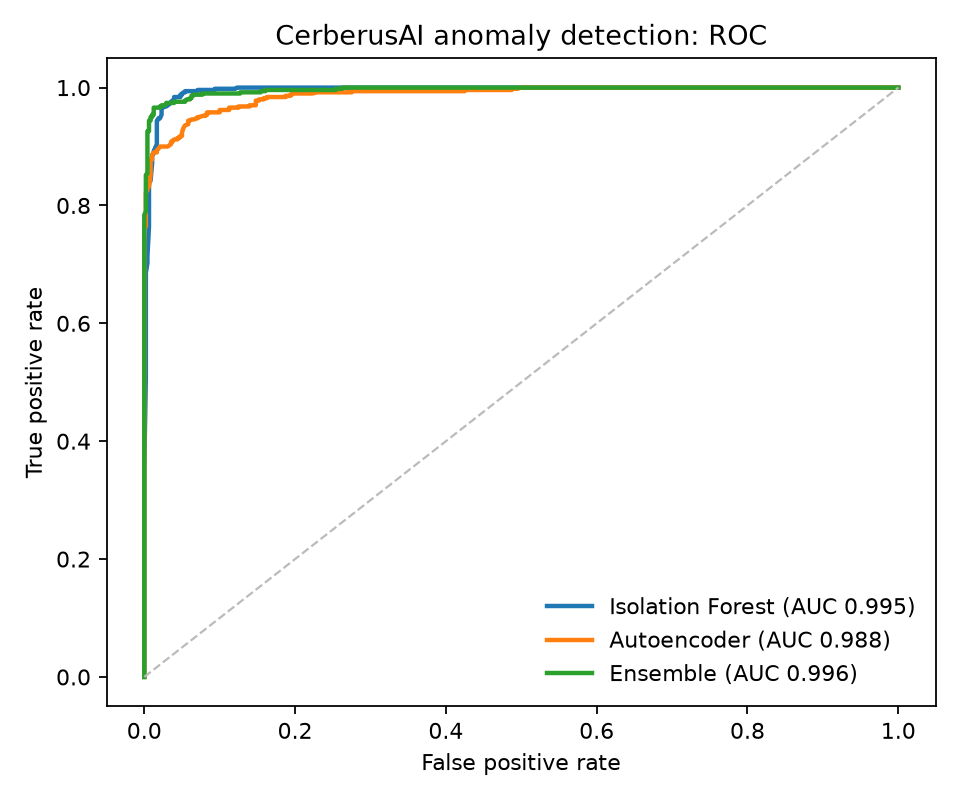

# CerberusAI

**An open-source, read-only agentic SOC.**

Most enterprises already own the tools for a strong SOC. What they lack is the people and expertise
to run them at full strength. CerberusAI closes that gap. It plugs into your SIEM, works with any LLM
you choose, and continuously reads your alert traffic to build a live baseline of how your network
actually behaves. The moment your SIEM flags something, it investigates on its own: it checks the
alert against that baseline, pulls the device's history, decides whether the behavior is normal, and
returns an auto-close or escalate verdict with plain-English evidence in seconds. It becomes the most
knowledgeable analyst on the team, one that never sleeps and never forgets.


> Not a lab toy or a simulator. You connect it to **your own** SIEM and it starts working.


<sub>The operations console. CerberusAI escalated a server that suddenly reached a production
database it had never touched before, and handed the analyst the whole story (plain-English summary,
attack path, MITRE techniques, and what it verified) before a human opened the ticket. Illustrative
demo data; reproduce it with `python lab/demo_fixture.py`.</sub>

---

## See it in action

The two cases below are the **same source IP**. What separates them is not the alert, since both are
SSH brute-force failures. It is the *context* CerberusAI learned about the network.

**Auto-closed: noise cleared automatically.**


<sub>A server hammering a host it always talks to, no successful logins, volume within its own
baseline. Score 2/10, closed with no human involved. "~30 minutes of manual triage avoided."</sub>

**Escalated: lateral movement caught.**

The hero screenshot at the top is that same source a moment later, now reaching `secure-db`, a
critical asset it has **never** contacted before. Same brute force, score 8/10, routed to a senior
analyst. A static rule sees two identical brute-force alerts; CerberusAI sees one benign and one
textbook pivot, because it had learned the network's normal shape.

---

## Why it is easy to adopt

- **Quick to integrate.** Setup is a short browser wizard: point it at your SIEM, paste a read-only
  key, test the connection, and you are running. No agents to deploy and no code to write.
- **No security expertise required.** The wizard is plain, standard English, and the dashboard
  explains every incident the same way, so you do not have to be a seasoned analyst to set it up or
  to understand its verdicts.
- **Useful on day one, better every week.** It works immediately and sharpens as it learns your
  network.
- **Your stack, your rules.** Bring whichever LLM your organization already approved and point it at
  whatever SIEM you run.

## How you connect it, and why it is safe

You connect CerberusAI to your SIEM through its **API**: you give it the SIEM's address and a
read-only login (or an API key or token). The setup wizard tests that connection before it saves
anything, so you know it works up front.

The whole design is built around one idea: **it only ever reads.**

- **It only gets the access you hand it.** You give it one read-only credential. It can reach exactly
  what that credential allows and nothing more.
- **It is a one-way pull.** Data flows out of your SIEM into CerberusAI. Nothing flows back.
- **It makes zero changes.** It never blocks, quarantines, patches, pushes configuration, or runs a
  command, not on your SIEM, your hosts, or your network gear. There is no write path in the code.
- **Its verdicts stay on its own dashboard.** A human decides what to act on; CerberusAI never
  reaches into your systems to do it.

Same principle for anything you point it at: you control the credential, and it only reads. That
read-only, one-way posture is deliberate, and it is far easier to get approved in a security or
government environment than anything that could change production.

---

## How it gets smarter over time

This is the core idea. CerberusAI starts knowing nothing about your network and teaches itself as it
works. It keeps a local memory (a SQLite database) that starts empty and fills itself, and that
memory is what turns a generic LLM into something that understands *your* specific network. The core
reasoning is deterministic (statistics and a graph, not a black box), and on top of it an optional,
explainable machine-learning layer adds one more signal (see below).

Every case it works adds facts to that memory:

- **Entities.** The assets it has seen, and how critical each one is.
- **Relationships (topology).** Which machines normally talk to which (`source → target` edges).
  This is the map of "normal" that the escalation above depends on.
- **Baselines.** Each asset's own usual activity, such as its normal failed-login volume, so "a lot"
  is measured against *that host's* history rather than a global guess.
- **Past verdicts.** What it decided before, so repeat offenders and known-good patterns are
  recognized on sight.

**How it connects the dots.** When the next alert arrives, it reads that memory before it decides and
lines the new activity up against what it has learned. Is this a connection the network has never
made before, especially to a critical asset? Is this volume far above what is normal for this
specific host? Has this source caused trouble in the past? Each answer is a concrete signal it
weighs, instead of judging the alert in isolation. That is how it tells two identical brute-force
alerts apart: one hitting a host it always talks to is routine, while the same source reaching a
database it has never touched is a pivot.

The longer it runs, the more complete that picture of "normal" becomes, so its read on normal versus
suspicious keeps getting more accurate. On day one it is cautious because it has little history.
After a week on your real traffic it knows your topology and baselines, and its auto-close calls get
both more confident and more trustworthy.

Two design choices make that learning hold up in the real world:

- **It stays explainable.** The core reasoning is deterministic statistics and a graph: z-scores
  against an asset's own history, and an unprecedented-edge check against the learned topology. Every
  number is auditable (for example, *240 failed logins against a baseline of about 5 is a clear
  outlier*), which matters enormously in security and compliance. Even the optional ML layer below
  reports the features that drove its score, so no verdict is a mystery number.
- **Its memory survives IP churn.** It keys everything on a stable identity (hostname, agent, or
  asset id) and treats the IP as a live pointer. The history it learned about a host is not thrown
  away when DHCP hands out a new lease, a container restarts, or a cloud box autoscales, which is the
  exact thing that breaks naive IP-based tooling.

---

## The explainable ML anomaly layer (optional)

The per-host statistics above catch single-metric anomalies. To catch unusual *combinations* of
behavior at once, CerberusAI can run an optional, **explainable** machine-learning layer: a UEBA-style
anomaly-detection **ensemble** of an **Isolation Forest** and an **autoencoder**, trained unsupervised
on the behavior it has observed. It produces an anomaly score plus the features that drove it, and the
agent treats that as **one more signal, never the final say**. The deterministic core still makes the
verdict.

It keeps the auditability story: every score comes with feature attributions (which behaviors pushed
it up), so it is not a black box. On a held-out evaluation against normal traffic mixed with synthetic
attacks (reproduce with `python -m ml.evaluate`):

| Model | ROC-AUC | Precision | Recall | F1 |
|-------|:------:|:--------:|:-----:|:--:|
| Isolation Forest | 0.995 | 0.954 | 0.988 | 0.971 |
| Autoencoder | 0.988 | 0.956 | 0.912 | 0.933 |
| **Ensemble** | **0.996** | **0.988** | **0.958** | **0.973** |



The ensemble beats either model alone, which is why they are combined. Details, feature set, training,
and retraining on your real traffic are in [`ml/README.md`](ml/README.md). The layer is entirely
optional (`pip install -r requirements-ml.txt`); without it, CerberusAI runs exactly as before.

---

## Methods and strategies

The engineering decisions behind it, the parts I am most proud of:

- **Grounded agentic investigation.** The agent runs a real tool loop with three **read-only** tools
  (recall memory, query the SIEM, check topology drift) and must justify its verdict from evidence it
  actually retrieved. If the evidence is thin, it abstains and escalates rather than inventing a
  breach. No hallucinated conclusions.
- **Determinism through structured outputs.** The verdict is a strict Pydantic schema, so the model
  is constrained to a validated shape every time. Reliability comes from the contract, not from
  fiddling with temperature.
- **Bring your own LLM.** Provider-agnostic via a thin LiteLLM layer: Anthropic, OpenAI, Azure
  OpenAI, Google Gemini, DeepSeek, or any compatible endpoint. Organizations use the model their
  security team already approved.
- **SIEM-agnostic by design.** Every SIEM sits behind a small three-method adapter, so the reasoning
  engine never changes when you swap platforms. Adding a SIEM is one new file.
- **Executive translation layer.** Raw telemetry is translated into a story a CISO can read at a
  glance: friendly asset names, business impact, humanized MITRE techniques, a clear decision. That
  is what the screenshots show.
- **Read-only as the moat.** It never writes to, blocks, quarantines, or reconfigures anything. That
  posture is deliberate: it is far easier to get approved by a risk-averse security or government
  team than anything that can change system state.
- **Also an MCP server.** The triage engine is exposed as a Model Context Protocol tool, so it can be
  called directly from Claude Desktop or Claude Code as well as from the web console.

---

## Architecture

```
Your SIEM ──► CerberusAI agent (read-only tools)          ┌─ learns your network over time
   alerts       recall memory · query SIEM · drift check  │  (assets, who-talks-to-whom, baselines,
                          │                                │   verdicts), keyed on stable identity,
                          ▼                                │   so it survives DHCP / cloud IP churn
              grounded verdict + DECISION  ◄───────────────┘
              (auto-close / monitor / escalate)
                          │
                          ▼
              Operations console  (multi-user, role-based, HTTPS)
```

The transport is kept separate from the logic on purpose: the reasoning engine is a plain,
unit-testable function, while the MCP server, the web console, and the SIEM poller are thin wrappers
around it.

---

## Try it in two minutes (no SIEM, no API key)

See the console with representative demo data, straight from a clone:

```bash
pip install -r requirements.txt
python lab/demo_fixture.py                 # seeds a demo investigation
python -m uvicorn dashboard:app --port 8787
```

Open **http://localhost:8787**. The demo fixture writes its verdicts through the exact same code path
the live agent uses, so what you see is shaped like the real thing. It is just fed canned inputs
instead of a live SIEM.

## Deploy for real

```bash
git clone https://github.com/justinbarrow30/cerberus-ai && cd cerberus-ai
docker compose up -d
```

Open **http://localhost:8787** and complete the browser setup wizard: connect your SIEM (URL and
read-only credentials, then Test Connection), connect your LLM (paste a key, then Verify), and
Initialize. No config files, no editing code. For an ACAS-style deployment (one server, a clean HTTPS
domain, analysts log in), see `docker-compose.https.yml` and `Caddyfile`.

### Supported SIEMs

The brain is SIEM-agnostic; each platform sits behind a small adapter.

| SIEM | Status |
|------|--------|
| **Wazuh** | ✅ Supported (tested end-to-end against a live lab) |
| **Elastic Security** | ✅ Supported (OpenSearch adapter; may need field-map tweaks) |
| **Security Onion** | ✅ Supported (OpenSearch adapter; may need field-map tweaks) |
| **Microsoft Sentinel** | 🟡 Adapter built: Entra ID auth plus KQL, Commercial **and** Government clouds; unit-tested against mocked Log Analytics. Validate against a live workspace with the free-tier walkthrough in [`SENTINEL_TESTING.md`](SENTINEL_TESTING.md) |
| Splunk, CrowdStrike Falcon LogScale, QRadar, … | 🛣️ Roadmap; contributions welcome |

Adding a SIEM means subclassing one interface in [`siem/`](siem/): three methods
(`test_connection`, `list_recent_sources`, `query_source_activity`). The reasoning engine never
changes.

---

## Read this first (what it does and does not do)

- **Read-only.** It only reads from your SIEM and reasons about alerts. It never writes to, blocks,
  quarantines, patches, or reconfigures anything, not your SIEM, not your hosts, not your network
  gear. There is deliberately no switch or firewall automation.
- **It sends alert text to your chosen LLM.** To investigate an alert, the relevant alert text is
  sent to the LLM provider you configure, using your own API key. That is the only thing that leaves
  your environment. If sending alert data to a third-party LLM needs review in your org, review it
  before deploying, or point it at a private or self-hosted model.
- **No telemetry, no phone-home.** CerberusAI collects nothing and sends nothing to the project.
- **You bring your own key.** API usage is billed to your key.

## Tech stack

Python 3.12 · FastAPI and Uvicorn · Pydantic v2 (structured outputs) · LiteLLM (provider-agnostic) ·
Model Context Protocol · SQLite (self-growing memory) · OpenSearch and KQL SIEM adapters ·
scikit-learn and PyTorch (optional anomaly-detection ensemble) · Docker and Caddy (HTTPS) ·
PBKDF2 auth with role-based access.

## License

[MIT](LICENSE) © 2026 Justin Barrow.
