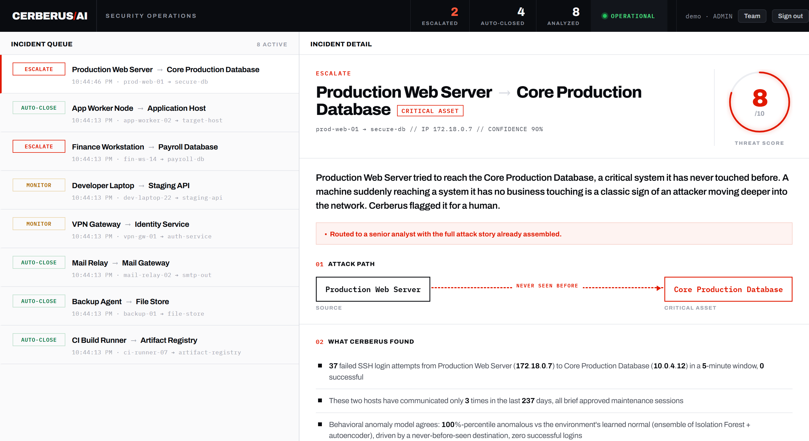
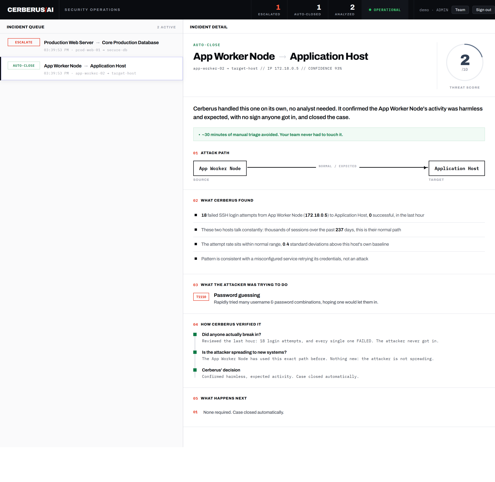

# CerberusAI

**An open-source, read-only agentic SOC.** Point it at your SIEM and it investigates
security alerts on its own — querying the SIEM, checking what is normal for *your* network, and
returning a decision (**auto-close** or **escalate**) with plain-English reasoning and evidence.
It exists to kill alert fatigue: let the machine clear the noise so human analysts only see what
actually matters.


> Not a lab toy or a simulator. You connect it to **your own** SIEM and it starts working.



<sub>The operations console. CerberusAI escalated a server that suddenly reached a production
database it had never touched before, and handed the analyst the whole story — plain-English
summary, attack path, MITRE techniques, and what it verified — before a human opened the ticket.
(Illustrative demo data; reproduce it with `python lab/demo_fixture.py`.)</sub>

---

## The problem it solves

A modern SIEM throws off thousands of alerts a day. The overwhelming majority are noise — a
mistyped password, a scanner, a known service. But a tier-1 analyst still has to open each one,
pull context, decide, and move on. That is where real attacks get buried and burnout happens.

CerberusAI puts an autonomous analyst in front of that firehose. For every alert it does the
investigation a human would — *then returns a verdict*, not a to-do list.

## See it in action

The two cases below are the **same source IP**. What separates them is not the alert — both are
SSH brute-force failures — it is the *context* CerberusAI learned about the network.

**Auto-closed — noise cleared automatically:**



<sub>A server hammering a host it always talks to, no successful logins, volume within its own
baseline. Score 2/10, closed with no human involved — "~30 minutes of manual triage avoided."</sub>

**Escalated — lateral movement caught:**

The hero screenshot at the top is that same source a moment later, now reaching `secure-db` — a
critical asset it has **never** contacted before. Same brute force, score 8/10, routed to a senior
analyst. A static rule sees two identical brute-force alerts; CerberusAI sees one benign and one
textbook pivot, because it had learned the network's normal shape.

---

## How you connect it — and why it's safe

You connect CerberusAI to your SIEM through its **API** — you give it the SIEM's address and a
read-only login (or an API key / token). The setup wizard tests that connection before it saves
anything, so you know it works up front.

The whole design is built around one idea: **it only ever reads.**

- **It only gets the access you hand it.** You give it one read-only credential. It can reach
  exactly what that credential allows — nothing more.
- **It's a one-way pull.** Data flows *out* of your SIEM into CerberusAI. Nothing flows back.
- **It makes zero changes.** It never blocks, quarantines, patches, pushes configuration, or runs
  a command — not on your SIEM, your hosts, or your network gear. There is no write path in the code.
- **Its verdicts stay on its own dashboard.** A human decides what to act on; CerberusAI never
  reaches into your systems to do it.

Same principle for anything you point it at: you control the credential, and it only reads. That
read-only, one-way posture is deliberate — it is far easier to get approved in a security or
government environment than anything that could change production.

---

## How it gets smarter over time

This is the core idea. **CerberusAI starts knowing nothing about your network and teaches itself
as it works.** Every investigation writes to a local SQLite "memory" that starts empty and fills
itself — and that memory is what turns a generic LLM into something that understands *your* specific network.

Each verdict records four things:

- **Entities** — the assets it has seen, and how critical each one is.
- **Relationships (topology)** — who normally talks to whom (`source → target` edges). This is the
  map of "normal" that makes the escalation above possible.
- **Metrics (baselines)** — each asset's own normal failed-login volume, so "a lot" is measured
  against *that host's* history, not a global guess.
- **Verdicts** — what it decided before, so repeat offenders and known-good patterns are recognized.

The longer it runs, the sharper every one of those gets. On day one it escalates conservatively
because it has little context; after a week of your real traffic it knows your topology and
baselines, and its auto-close decisions get both more confident and more trustworthy — it is
learning the shape of *your* network, not a textbook's.

Two design choices make that learning hold up in the real world:

- **It is explainable, not a black box.** The "intelligence" is deterministic statistics and a
  graph — z-scores against an asset's own history, and an unprecedented-edge check against the
  learned topology. Every number is auditable (e.g. *240 failed logins vs a ~5 baseline = anomalous*),
  which matters enormously in security and compliance settings. There is no opaque ML model whose
  verdict you cannot defend.
- **Memory survives IP churn.** It keys everything on a **stable identity** (hostname / agent /
  asset id) and treats the IP as a live pointer. So the history it learned about a host is not
  thrown away when DHCP hands out a new lease, a container restarts, or a cloud box autoscales —
  the exact thing that breaks naive IP-based tooling.

---

## Methods & strategies

The engineering decisions behind it — the parts I am most proud of:

- **Grounded agentic investigation.** The agent runs a real tool loop with three **read-only**
  tools — recall memory, query the SIEM, check topology drift — and must justify its verdict from
  evidence it actually retrieved. If the evidence is thin, it *abstains and escalates* rather than
  inventing a breach. No hallucinated conclusions.
- **Determinism through structured outputs.** The verdict is a strict Pydantic schema, so the model
  is constrained to a validated shape every time. Reliability comes from the contract, not from
  fiddling with temperature.
- **Bring your own LLM.** Provider-agnostic via a thin LiteLLM layer — Anthropic, OpenAI, Azure
  OpenAI, Google Gemini, DeepSeek, or any compatible endpoint. Organizations use the model their
  security team already approved.
- **SIEM-agnostic by design.** Every SIEM sits behind a small three-method adapter, so the
  reasoning engine never changes when you swap platforms. Adding a SIEM is one new file.
- **Executive translation layer.** Raw telemetry is translated into a story a CISO can read at a
  glance — friendly asset names, business impact, humanized MITRE techniques, a clear decision.
  That is what the screenshots show.
- **Read-only as the moat.** It never writes to, blocks, quarantines, or reconfigures anything.
  That posture is deliberate: it is far easier to get approved by a risk-averse security or
  government team than anything that can change system state.
- **Also an MCP server.** The triage engine is exposed as a Model Context Protocol tool, so it can
  be called directly from Claude Desktop / Claude Code as well as from the web console.

---

## Architecture

```
Your SIEM ──► CerberusAI agent (read-only tools)          ┌─ learns your network over time
   alerts       recall memory · query SIEM · drift check  │  (assets, who-talks-to-whom, baselines,
                          │                                │   verdicts) — keyed on stable identity,
                          ▼                                │   so it survives DHCP / cloud IP churn
              grounded verdict + DECISION  ◄───────────────┘
              (auto-close / monitor / escalate)
                          │
                          ▼
              Operations console  (multi-user, role-based, HTTPS)
```

The transport is kept separate from the logic on purpose: the reasoning engine is a plain,
unit-testable function; the MCP server, the web console, and the SIEM poller are thin wrappers
around it.

---

## Try it in two minutes (no SIEM, no API key)

See the console with representative demo data, straight from a clone:

```bash
pip install -r requirements.txt
python lab/demo_fixture.py                 # seeds a demo investigation
python -m uvicorn dashboard:app --port 8787
```

Open **http://localhost:8787**. The demo fixture writes its verdicts through the exact same code
path the live agent uses, so what you see is shaped like the real thing — it is just fed canned
inputs instead of a live SIEM.

## Deploy for real

```bash
git clone https://github.com/justinbarrow30/cerberus-ai && cd cerberus-ai
docker compose up -d
```

Open **http://localhost:8787** and complete the browser setup wizard — connect your SIEM (URL +
read-only credentials, Test Connection), connect your LLM (paste a key, Verify), and Initialize.
No config files, no editing code. For an ACAS-style deployment (one server, a clean HTTPS domain,
analysts log in), see `docker-compose.https.yml` + `Caddyfile`.

### Supported SIEMs

The brain is SIEM-agnostic; each platform sits behind a small adapter.

| SIEM | Status |
|------|--------|
| **Wazuh** | ✅ Supported (tested end-to-end against a live lab) |
| **Elastic Security** | ✅ Supported (OpenSearch adapter; may need field-map tweaks) |
| **Security Onion** | ✅ Supported (OpenSearch adapter; may need field-map tweaks) |
| **Microsoft Sentinel** | 🟡 Adapter built — Entra ID auth + KQL, Commercial **and** Government clouds; unit-tested against mocked Log Analytics. Validate against a live workspace with the free-tier walkthrough in [`SENTINEL_TESTING.md`](SENTINEL_TESTING.md) |
| Splunk, CrowdStrike Falcon LogScale, QRadar, … | 🛣️ Roadmap — contributions welcome |

Adding a SIEM means subclassing one interface in [`siem/`](siem/) — three methods
(`test_connection`, `list_recent_sources`, `query_source_activity`). The reasoning engine never
changes.

---

## Read this first (what it does and does not do)

- **Read-only.** It only reads from your SIEM and reasons about alerts. It never writes to, blocks,
  quarantines, patches, or reconfigures anything — not your SIEM, not your hosts, not your network
  gear. There is deliberately no switch/firewall automation.
- **It sends alert text to your chosen LLM.** To investigate an alert, the relevant alert text is
  sent to the LLM provider you configure, using your own API key. That is the only thing that
  leaves your environment. If sending alert data to a third-party LLM needs review in your org,
  review it before deploying (or point it at a private/self-hosted model).
- **No telemetry, no phone-home.** CerberusAI collects nothing and sends nothing to the project.
- **You bring your own key.** API usage is billed to your key.

## Tech stack

Python 3.12 · FastAPI + Uvicorn · Pydantic v2 (structured outputs) · LiteLLM (provider-agnostic) ·
Model Context Protocol · SQLite (self-growing memory) · OpenSearch / KQL SIEM adapters ·
Docker + Caddy (HTTPS) · PBKDF2 auth with role-based access.

## License

[MIT](LICENSE) © 2026 Justin Barrow.
